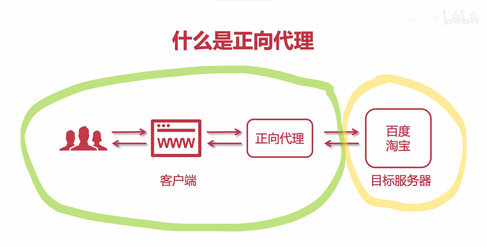

# <font color="#20B2AA" size="8">LVS</font> + <font color="#FF7F50" size="8">Nginx</font>实现高可用集群
---------------------------------------
- ### 2.1什么是Nginx
> - Nginx是一个高性能的HTTP和反向代理Web服务器，同时也提供`IMAP(Internet Message Access Protocol)`/`POP3(Post Office Protocol-Version 3)`/`SMTP(Simple Mail Transfer Protocol)`服务
> - 主要功能是`反向代理`
> - 通过配置文件可以实现集群和负载均衡
> - 静态资源虚拟化
----------------------------------------------
- #### 2.1.1在网络中Nginx的作用

> - <font color="#FF1493" size="4">Nginx在此处相当于一个负载均衡器和反向代理器(网关)</font><br />
- ### 2.2常见的Web服务器
---------------------------------
> |<font color="#FF7F50" size="3">Web服务器</font><br />|<font color="#FF7F50" size="3">用途</font><br />|
|:---:|:---:|
|`MS IIS`|发布`asp.net`的项目|
|`Weblogic`与`Jboss`|用于传统行业：`ERP`/`物流`/`电信`/`金融`，两者服务皆是收费的|
|`Tomcat`与`Jetty`|使用J2EE的开发，多数以`Tomcat`为主|
|`Apache`与`Nginx`|都是反向代理服务器，都可以发布静态服务，`Nginx`成本更低，配置简单，支持并发量更高，随时间推移`Nginx`的各项占有率都渐渐追上甚至反超了`Apache`|
|`Netty`|是高性能的，通过编码开发相应服务器|

---------------------------------------
- ### 2.3正向代理与反向代理
----------------------------------------
- #### 2.3.1正向代理
- 客户端请求目标服务器之间的一个代理服务器
- 客户端发起的请求会先经过代理服务器，之后将请求转发到目标服务器，获得内容后最后响应给客户端


-----------------------------------------
- #### 2.3.2反向代理
- 用户请求目标服务器，由代理服务器决定访问哪个IP


通过命令行观察反向代理，先`ping`一下淘宝：
```bash
ping www.taobao.com
# 以下为得到结果
正在 Ping www.taobao.com.danuoyi.tbcache.com [111.3.78.233] 具有 32 字节的数据:
来自 111.3.78.233 的回复: 字节=32 时间=10ms TTL=49
来自 111.3.78.233 的回复: 字节=32 时间=10ms TTL=49
来自 111.3.78.233 的回复: 字节=32 时间=8ms TTL=49
来自 111.3.78.233 的回复: 字节=32 时间=10ms TTL=49

111.3.78.233 的 Ping 统计信息:
    数据包: 已发送 = 4，已接收 = 4，丢失 = 0 (0% 丢失)，
往返行程的估计时间(以毫秒为单位):
    最短 = 8ms，最长 = 10ms，平均 = 9ms
```
之后再次`ping`一下淘宝：
```bash
ping www.taobao.com
# 以下为得到结果
正在 Ping www.taobao.com.danuoyi.tbcache.com [111.3.78.232] 具有 32 字节的数据:
来自 111.3.78.232 的回复: 字节=32 时间=8ms TTL=49
来自 111.3.78.232 的回复: 字节=32 时间=10ms TTL=49
来自 111.3.78.232 的回复: 字节=32 时间=10ms TTL=49
来自 111.3.78.232 的回复: 字节=32 时间=11ms TTL=49

111.3.78.232 的 Ping 统计信息:
    数据包: 已发送 = 4，已接收 = 4，丢失 = 0 (0% 丢失)，
往返行程的估计时间(以毫秒为单位):
    最短 = 8ms，最长 = 11ms，平均 = 9ms
```
- 可以看到两次`ping`操作访问的节点不同，这是被淘宝的反向代理分配了最终请求抵达的服务器；
- 而我们之前所述的`集群`与`负载均衡(LB)`就是通过反向代理实现的，反向代理就是我们讨论的重点。
---------------------------------------------
- #### 2.3.3反向代理之路由
- 通过Nginx可以实现一些虚拟主机、路由的分发和请求

- 如上图，用户请求了三种类型：`shop`、`center`以及`image`
- 后端有3个服务器：**Tomcat 1**、**Tomcat 2**以及**静态资源服务器**
- 图上现有项目的域名后都带有一个端口，通过`Nginx`可以完全规避端口
- 图上策略是通过`Tomcat`虚拟化图片资源，而通过`Nginx`可以发布所有图片，当用户请求图片时，用`Nginx`可以替代`Tomcat`虚拟目录的作用


