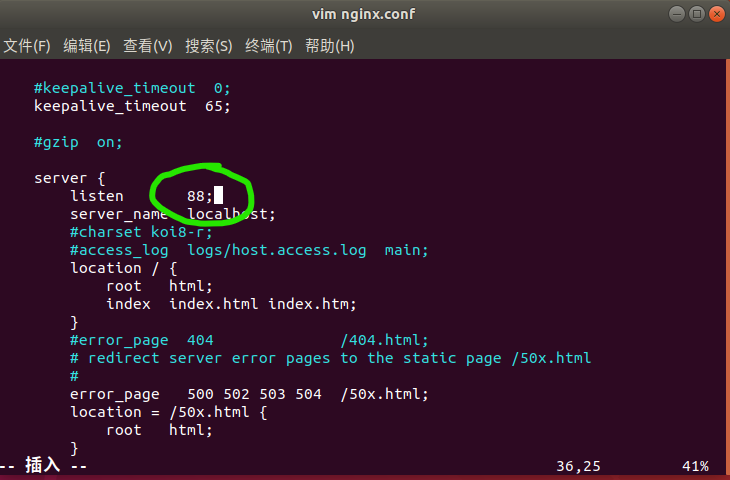
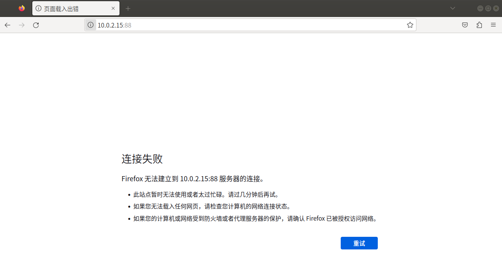
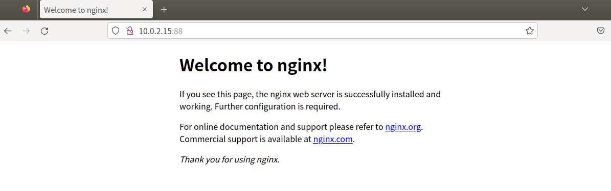
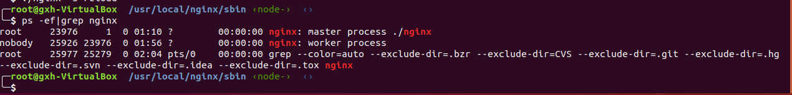
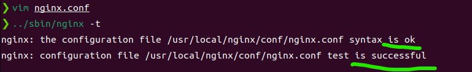
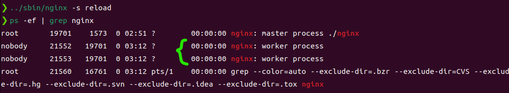
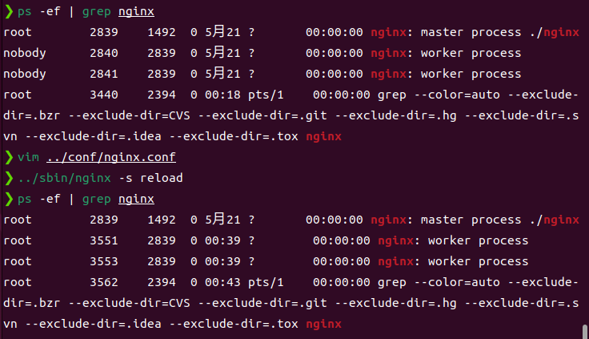
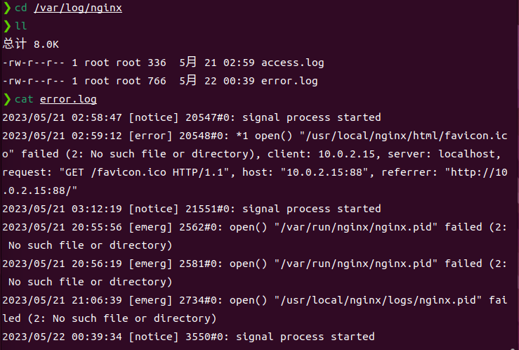
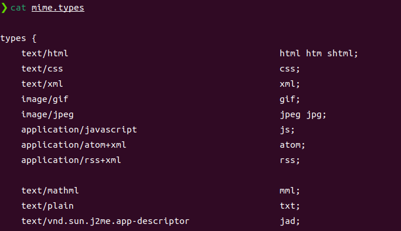
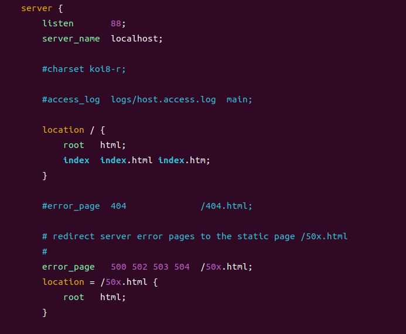

# <font color="#20B2AA" size="8">LVS</font> + <font color="#FF7F50" size="8">Nginx</font>实现高可用集群
---------------------------------------
- ### 3.1<font color="#FF7F50">Nginx</font>安装与运行
----------------------------------
- #### 3.1.1下载Linux环境可用的<font color="#FF7F50">Nginx</font>包
  - [点此下载](http://nginx.org/en/download.html)  ⚠️建议下载Stable version以保证稳定运行
  - 上传Nginx到linux系统
  - 安装依赖环境(__*以下以CentOS为例，Ubuntu的安装命令有所不同*__)
    - 1.安装gcc
      - `yum install gcc-c++`
    - 2.安装PCRE库，用于解析正则表达式
      - `yum install -y pcre pcre-devel`
    - 3.zlib压缩和解压缩依赖
      - `yum install -y zlib zlib-devel`
    - 4.SSL安全加密的套接字协议层，用于HTTP安全传输，也就是https
      - `yum install -y openssl openssl-devel`
  - 解压，值得注意的是，解压后得到的是源码，源码需要编译后才能安装，我用的版本是1.24.0
    - `tar -zxvf nginx-1.24.0.tar.gz`
  - 编译之前，先创建nginx临时目录，如果不创建则可能会在启动时报错
    - `mkdir /var/temp/nginx -p`
  - 在nginx目录，输入如下命令进行配置，目的是为了创建makefile文件
    - ```
      ./configure \
      --prefix=/usr/local/nginx \
      --pid-path=/var/run/nginx/nginx.pid \
      --lock-path=/var/lock/nginx.lock \
      --error-log-path=/var/log/nginx/error.log \
      --http-log-path=/var/log/nginx/access.log \
      --with-http_gzip_static_module \
      --http-client-body-temp-path=/var/temp/nginx/client \
      --http-proxy-temp-path=/var/temp/nginx/proxy \
      --http-fastcgi-temp-path=/var/temp/nginx/fastcgi \
      --http-uwsgi-temp-path=/var/temp/nginx/uwsgi \
      --http-scgi-temp-path=/var/temp/nginx/scgi
      ```
    - 配置命令释义
      |命令|解释|
      |:--:|:--:|
      |--prefix|指定nginx安装目录|
      |--pid-path|指向nginx的pid|
      |--lock-path|锁定安装文件，防止被恶意篡改或误操作|
      |--error-log|错误日志|
      |--http-log-path|http日志|
      |--with-gttp_gzip_static_module|启用gzip模块，在线实时压缩输出数据流|
      |--http-client-body-temp-path|设定客户端请求的临时目录|
      |--http-proxy-temp-path|设定http代理临时目录|
      |--http-fastcgi-temp-path|设定fastcgi临时目录|
      |--http-uwsgi-temp-path|设定uwsgi临时目录|
      |--http-scgi-temp-path|设定scgi临时目录|
  - make编译
    - `make`
  - 安装
    - `make install`
  - 进入sbin目录启动nginx
    - `cd /usr/local/nginx/sbin`
    - `./nginx`
      - 停止： `./nginx -s stop`
      - 重新加载： `./nginx -s reload`
  - 打开浏览器，访问虚拟机所处内网IP即可打开nginx默认页面
    - `ifconfig`可获取当前虚拟机的IP
    - 将IP复制到浏览器进入即可
      > 

  - **<font color="#a0ff0e">⚠️注意事项</font>**
    - 1. 如果在云服务器安装，需要开启默认nginx端口：80
    - 2. 如果在虚拟机安装，关闭防火墙
    - 3. 本地win或mac需要关闭防火墙
----------------------------
- #### 3.1.2<font color="#FF7F50">Nginx</font>显示默认首页过程解析
默认监听端口为80，在nginx配置文件中，server的监听端口等设置均可更改
  - 进入nginx根目录
    - `cd /usr/local/nginx/`
  - 查看当前文件，并进入conf文件夹
    - `ll`
    - `cd conf/`
  - 在conf中找到nginx.conf文件，并用vim打开
    - `ll`
    - `vim nginx.conf`
  - 修改server中的默认监听端口为88
    > 
  - 当访问内网IP的88端口时，连接失败，是因为更改配置之后nginx服务器并未刷新，因此需要重新加载
    > 
    - `cd /usr/local/nginx/sbin/`
    - `./nginx -s reload`
    > 
    - 发现修改成功
--------------------------------------
- ### 3.2<font color="#FF7F50">Nginx</font>的进程模型
---------------------------------------
  - master进程：主进程
  - worker进程：工作进程
  - worker是对master进行服务的
----------------------------------------
> 输入命令`ps -ef | grep nginx`查看当前nginx的进程  
>   

- 当前有一个master进程和一个worker进程，master进程管理着worker进程，若worker异常退出，则master会重新启动新的worker  

打开`nginx.conf`文件，可以看到worker的数量默认为1：
>   

我们将其修改为2，并输入指令查看配置文件是否正常：
`../sbin/nginx -t`
可以看到目前配置文件有效
  
重启nginx服务后，再次查看进程：
```bash
../sbin/nginx -s reload
ps -ef | grep nginx
```
  

Nginx的进程模型大致如下所示
> 

在这种模式之下，Nginx服务器具有良好的容错机制，面对异常的worker只需在其连接结束后杀掉并重新提起新的进程，若worker无连接则可以直接杀掉

----------------------------------

> - 传统服务器事件处理

master监听到请求后由worker1处理


当client1的任务需要处理很久，一直占用worker1，会形成阻塞，其他client的请求会一直排队


当worker1阻塞后，master会开出一个新的worker2，以此类推


但是这种处理方式的缺点十分明显，当并发量足够大的时候，进程量会达到一个比较夸张的地步，因此<font color="#FD1111">效率极低</font>

-------------------------

> - Nginx最高可承载高达几十万甚至几百万的并发量，其原理是什么呢？

---------------------------------

- 上图体现了Nginx中的进程管理机制：
  - 从master中fork出几个worker进程
  - 客户端访问服务器时有**互斥锁**(accept_mutex)
  - 不同的worker进程抢占客户端的请求，抢到之后才会处理该请求

---------------------------------

> - Nginx事件处理

Nginx拥有异步、非阻塞的特点，面对多个Client请求时，即便Client1目前已经阻塞，它依然会继续处理Client2、Client3等发送的请求


Linux会使用epoll这种事件机制（Nginx根据不同的操作系统会选择不同的操作模式）；  
使用epoll之后一个工作进程worker可以处理6-8万个请求，并发很高；  
同时，因为worker与CPU相关，CPU越多、内存越大，处理的并发数量越多；  


传统服务器面对一万个请求可能有一万个worker，但是对于Nginx而言，只需要1-3个worker就能满足需要

单个worker可以处理的请求数可以进行设置，如果设置太高可能会让CPU负荷太高；
如果单个worker请求数阈值设置太低，就可能变为传统服务器那样，令Client感到卡顿；

------------------------

打开nginx.conf，对events项进行配置
```bash
vim /usr/local/nginx/conf/nginx.conf
```
其实Nginx默认使用epoll，`use epoll`该条可以不写，然后将`worker_connections  1024`改为`worker_connections  8192`，保存并退出
```bash
events {
    # default using epoll
    use epoll;
    # connection number each worker could connect
    worker_connections  8192;
}
```
这样一来，每个worker最大连接数就变为了8192条，配置简单且有效

--------------------------------------
- ### 3.3<font color="#FF7F50">nginx.conf</font>的配置结构
--------------------------------------
首先，将我自己当前的nginx.conf列在下方：
```bash
#user  nobody;            # 指worker进程在执行时，由操作系统的哪一个用户进行执行，默认为nobody           

worker_processes  2;          # worker进程数量，可以预留一些CPU资源给中间件等服务

#error_log  logs/error.log;        # 错误日志

#error_log  logs/error.log  notice;      # 错误日志级别，linux中错误级别由低到高：debug < info < notice < warn < error < crit

#error_log  logs/error.log  info;

pid       /usr/local/nginx/logs/nginx.pid;       #指定nginx进程运行文件存放地址

events {
    use epoll;       #事件驱动模型，select|poll|kqueue|epoll|resig|/dev/poll|eventport
    worker_connections  8192;          #最大连接数，默认为1024

}

http {

    include       mime.types;         # 文件扩展名与文件类型映射表，从外部导入

    default_type  application/octet-stream;

    #log_format  main  '$remote_addr - $remote_user [$time_local] "$request" '     # remote_addr:客户端IP地址 # remote_user:客户端用户名称 # time_local：时间 # request：请求内容

    #                  '$status $body_bytes_sent "$http_referer" ' # status：是否成功的状态 # body_bytes_sent 客户端发送文件主体字节数 # http_referer 跳转站

    #                  '"$http_user_agent" "$http_x_forwarded_for"'; # http_user_agent 浏览器 # http_x_forwarded_for 进入客户端的IP

    #access_log  logs/access.log  main;                # 接入日志，记录Nginx请求次数

    sendfile        on;     # 高效传输文件

    #tcp_nopush     on;     # 当数据包累积到一定大小后开始发送，与sendfile配合使用

    #keepalive_timeout  0;     # 客户端连接服务器超时时间

    keepalive_timeout  65;

    #gzip  on;                 # gzip压缩开启，提高传输效率

    server {                # 定义虚拟主机

        listen       88;          # 监听端口

        server_name  localhost;      # 监听地址（域名或ip）

        #charset koi8-r;

        #access_log  logs/host.access.log  main;

        location / {            # 路由，斜杠即为根目录

            root   html;

            index  index.html index.htm;

        }

        #error_page  404              /404.html;    # 错误页面

        # redirect server error pages to the static page /50x.html

        #

        error_page   500 502 503 504  /50x.html;     # 重定向错误页面

        location = /50x.html {     # 重定向错误页面

            root   html;

        }

        # proxy the PHP scripts to Apache listening on 127.0.0.1:80

        #location ~ \.php$ {

        #    proxy_pass   http://127.0.0.1;

        #}

        # pass the PHP scripts to FastCGI server listening on 127.0.0.1:9000

        #location ~ \.php$ {

        #    root           html;

        #    fastcgi_pass   127.0.0.1:9000;

        #    fastcgi_index  index.php;

        #    fastcgi_param  SCRIPT_FILENAME  /scripts$fastcgi_script_name;

        #    include        fastcgi_params;

        #}

        # deny access to .htaccess files, if Apache's document root

        # concurs with nginx's one

        #location ~ /\.ht {

        #    deny  all;

        #}

    }

    # another virtual host using mix of IP-, name-, and port-based configuration

    #

    #server {

    #    listen       8000;

    #    listen       somename:8080;

    #    server_name  somename  alias  another.alias;


    #    location / {

    #        root   html;

    #        index  index.html index.htm;

    #    }

    #}

    # HTTPS server

    #server {

    #    listen       443 ssl;

    #    server_name  localhost;

    #    ssl_certificate      cert.pem;

    #    ssl_certificate_key  cert.key;

    #    ssl_session_cache    shared:SSL:1m;

    #    ssl_session_timeout  5m;

    #    ssl_ciphers  HIGH:!aNULL:!MD5;

    #    ssl_prefer_server_ciphers  on;

    #    location / {

    #        root   html;

    #        index  index.html index.htm;

    #    }

    #}

}
```

配置文件长度较长，Nginx的配置十分关键，基本上是日常使用Nginx的核心


- #### **Nginx使用者权限**  
修改`#username    nobody`为`user    root`，保存退出并重启服务`../sbin/nginx -s reload`
  
可以看到worker进程的使用用户变成了root

- #### **错误日志**  
`cd /var/log/nginx`进入日志目录  
`ll`查看日志文件目录  
`cat error.log`打印错误日志  
   
可以看到之前的错误日志记录在这里

- #### **pid**
虽然之前的安装config中设置了`--pid-path=/var/run/nginx/nginx.pid`，但最后不知为什么发现这个目录并不存在，所以在`/usr/local/nginx/logs/`目录下单独建立一个`nginx.pid`文件

- #### **include**
在`http`块中第一行看到`include    mime.types`，这是从外部导入的文件扩展名与文件类型映射表  
在`usr/local/nginx/conf`目录下，看到`mime.types`文件，打开看看：
  
这个指令块包含了常用的文件扩展名及其对应的文件类型  
这样一来，可读性大大提高，只需一行配置就能把所有需要的文件类型写入`nginx.conf`中  
> ⚠️下方的`default_type`即默认文件类型  

`default_type`是默认的`type`。比如当访问`/a`的时候，如果`a`文件存在，nginx会返回`a`文件，响应头`Content-type：application/octet-stream`。 浏览器对`application/octet-stream`的处理方式是下载，而不是展示。

- #### **access.log**
记录Nginx请求日志，包括请求的IP、时间、请求的URL、状态码、请求的字节数、来源URL、用户代理等等。

- #### **server**
虚拟主机，可以配置多个，每个虚拟主机可以有自己的配置，比如端口、域名、根目录等等。
在上述配置文件中，只有一个虚拟主机，监听端口为88，域名为localhost，根目录为`/usr/local/nginx/html`，访问`localhost:88`即可访问到`/usr/local/nginx/html`目录下的文件；
  
借助前述的`include`，可以将`server`写入`extra.conf`中，并在`http`内写上`include extra.conf`即可起到配置server的作用。

----------------------------------------
- ### 3.4<font color="#FF7F50">nginx.pid</font>打开失败以及失效的解决方案
----------------------------------------

😺第一种情况是：提示没有`/var/run/nginx/nginx.pid`的父目录，那么此时通过`mkdir /var/run/nginx`创建目录即可;  

🥳第二种情况是：提示`[error] invalid PID number xxxxxxxxx`，PID无效，此时使用`./nginx -c /usr/local/nginx/conf/nginx.conf`重新指定了`nginx.conf`的路径，接着重新启动`./nginx -s reload`

----------------------------------------
- ### 3.5<font color="#FF7F50">Nginx</font>常用命令解析
----------------------------------------
- #### **启动**  
`./nginx`
- #### **快速停止**  
`./nginx -s stop` 会立刻终止在该Nginx服务器上的所有服务
- #### **停止**  
`./nginx -s quit` 会等待工作进程处理完当前请求后再停止服务（仅针对HTTP请求）
- #### **重新加载配置文件**  
`./nginx -s reload`
- #### **重新打开日志文件**  
`./nginx -s reopen`
- #### **查看版本**  
`./nginx -v`
- #### **查看编译参数**  
`./nginx -V`
- #### **测试配置文件是否正确**  
`./nginx -t`
- #### **查看nginx进程**
`ps -ef | grep nginx`
- #### **查看nginx进程数**
`ps -ef | grep nginx | wc -l`
- #### **指定核心配置文件**
`./nginx -c /usr/local/nginx/conf/nginx.conf` 路径随意
- #### **指定错误日志文件**
`./nginx -e /usr/local/nginx/logs/error.log` 路径随意
- #### **指定进程pid文件**
`./nginx -p /usr/local/nginx/logs/nginx.pid` 路径随意

----------------------------------------
- ### 3.6<font color="#FF7F50">Nginx</font>日志切割
----------------------------------------
> 随着Nginx的日常使用，日志的大小会越来越大，所以需要定期对日志进行切割，以免占用过多的磁盘空间  

- #### **3.6.1 手动日志切割**
切割可以以天为单位，如果每天有几百G或者几个日志的话，可以按需每半天或每小时切割一次  

1>.创建一个shell可执行文件：`cut_my_log.sh`，内容为：

```shell
#!/bin/bash
#定义日志文件存放目录
logs_path="/usr/local/nginx/logs/"
#定义pid文件
pid_path="/usr/local/nginx/logs/nginx.pid"
#重命名日志文件
mv ${logs_path}access.log ${logs_path}access_$(date -d "yesterday" +"%Y%m%d").log
mv ${logs_path}error.log ${logs_path}error_$(date -d "yesterday" +"%Y%m%d").log
#向nginx主进程发送USR1信号，重新打开日志文件
kill -USR1 `cat ${pid_path}`
```

`kill -USR1`起什么作用？
> 通过`kill -USR1`信号，可以让nginx重新打开日志文件，而不用重启nginx，这样就可以实现日志切割了

2>.给文件赋予执行权限：`chmod +x cut_my_log.sh`

3>.执行脚本：`./cut_my_log.sh`

4>.查看日志文件：`ls /usr/local/nginx/logs/`，可以看到日志文件已经被重命名了

5>.查看nginx进程：`ps -ef | grep nginx`，可以看到nginx进程并没有被重启，只是重新打开了日志文件

6>.查看nginx进程数：`ps -ef | grep nginx | wc -l`，可以看到nginx进程数并没有增加

-----------------------------
- #### **3.6.2 定时任务日志切割**
-----------------------------
- ##### 安装定时任务：

```bash
yum install crontabs
```

- ##### `crontab -e` 编辑并且添加一行新的任务：

```bash
*/1 * * * * /usr/local/nginx/logs/cut_my_log.sh
```

- ##### 重启定时任务：

```bash
service crond restart
```

- ##### 附：常用定时任务

```bash
service crond start #启动服务
service crond stop #关闭服务
service crond restart #重启服务
service crond reload #重新载入配置
service crond status #查看服务状态
chkconfig crond on #开机启动服务
chkconfig crond off #开机关闭服务
chkconfig crond --list #查看服务当前状态
crontab -e #编辑定时任务
crontab -l #查看定时任务
```

- ##### 定时任务表达式：
cron表达式是，分为5或6个域，每个域代表一个含义，如下所示：  

||分|时|日|月|星期几|年|
|:----:|:----:|:----:|:----:|:----:|:----:|:----:|
|取值范围|0-59|0-23|1-31|1-12|1-7|2019/2020/2021/...|

- ##### 常用表达式

- 每分钟执行  

```bash
*/1 * * * *
```

- 每日凌晨(23:59`)执行  

```bash
59 23 * * *
```

- 每天凌晨1点执行  

```bash
0 1 * * *
```

- 每天凌晨1点到5点，每隔一小时执行  

```bash
0 1-5 * * *
```

- 每天凌晨1点到5点，每隔半小时执行  

```bash
0,30 1-5 * * *
``` 

- 每天凌晨1点到5点，每隔10分钟执行  

```bash
*/10 1-5 * * *
```

----------------------------------------
- ### 3.7<font color="#FF7F50">Nginx</font>为静态资源提供服务
----------------------------------------
参见foodie-shop项目

----------------------------------------
- ### 3.8 使用Gzip压缩提升请求效率
----------------------------------------
```conf
# 开启gzip压缩，目的是减少网络传输的数据量，加快传输速度
gzip on
# 压缩级别，1-10，数字越大压缩的越好，但是也越占用CPU资源
gzip_comp_level 5;
# 限制最小压缩文件，小于设置值的文件将不会压缩
gzip_min_length 1k;
# 设置压缩文件类型，可选值有 text/plain text/css application/json application/javascript application/x-javascript text/xml application/xml application/xml+rss text/javascript image/jpeg image/gif image/png;
gzip_types text/plain text/css application/javascript application/x-javascript text/xml application/xml application/xml+rss text/javascript image/jpeg image/gif image/png;
```

----------------------------------------
- ### 3.9 location匹配规则
----------------------------------------
```conf
server {
  listen 89;
  server_name localhost;

  location / {
    root /usr/local/nginx/html;
    index index.html index.htm;
  }
}

server {
  listen 90;
  server_name localhost;

  location / {
    root /home/foodie-shop;
    index index.html index.htm;
  }
}

serve {
  listen 91;
  server_name localhost;

  # 精确匹配
  location = /shop {
    alias /home/foodie-shop;
    index index.html index.htm;
  }
}

serve {
  listen 92;
  server_name localhost;

  # 正则表达式匹配。~表示区分大小写，~*表示不区分大小写
  location ~* /.(gif|jpg|jpeg|png|bmp|swf) {
    root /home/foodie-shop/img;
    index index.html index.htm;
  }
}

serve {
  listen 93;
  server_name localhost;

  # 前缀匹配, ^~表示前缀匹配，如果匹配到，就不再往下匹配
  location ^~ /img {
    root /home/foodie-shop;
    index index.html index.htm;
  }
}
```
----------------------------------------
- ### 3.10 DNS域名解析
----------------------------------------


利用[SwitchHosts](https://github.com/oldj/SwitchHosts/releases)便捷设置本地域名，可以将localhost改为自定义域名，如：`www.imooc.com`，`www.imooc.com`指向的是本地的`127.0.0.1:80`，此时浏览器键入`www.imooc.com`即可进入Nginx的首页

----------------------------------------
- ### 3.11 <font color="#FF7F50">Nginx</font>的跨域
----------------------------------------
